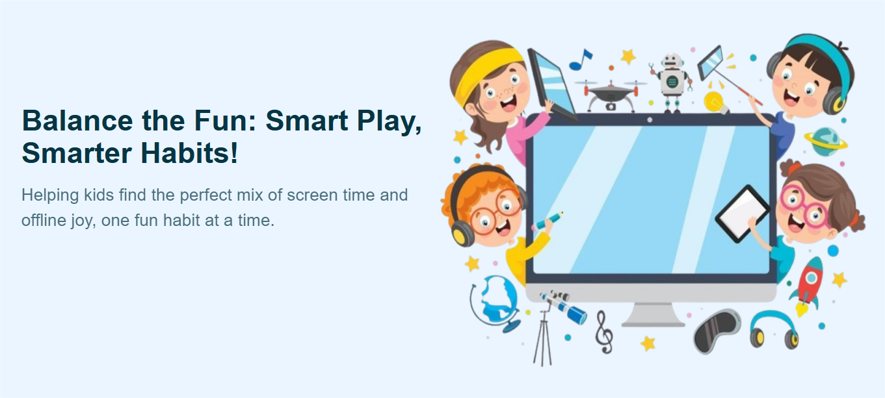

# KIDURA

## 📖 Overview

KIDURA is a comprehensive platform designed to support parents in managing their child's activities, development, and daily schedule.

With an array of personalized tools and interactive features, KIDURA encourages balanced screen habits, promotes learning through customized activities and provides parents with the resources needed to foster a supportive and engaging developmental environment for their children.

---

## 🌟 Features

### Screen Time Management
KIDURA enables parents to track and monitor their child's screen usage. Visualized through a *weekly graph* and *daily pie chart*, this feature empowers parents to effectively manage screen habits, supporting balanced screen time.

### Interest Profile & Custom Activity Suggestions
Parents can create a personalized interest profile for their child by filling out the *Interest Form*. Here, they can list hobbies, desired skill areas, exam schedules, and school hours. Based on this profile, KIDURA uses insights to suggest tailored activities, aligning with the child’s interests, screen time, school schedule, and past feedback. Suggestions include skill-building activities, such as playing chess with family, making recommendations both meaningful and engaging.

### Activity Scheduling & Notifications
Selected activities can be scheduled with defined time limits, and KIDURA sends notifications when the time limit is reached. Parents can then verify completion and track their child’s progress, ensuring active involvement in their developmental journey.

### Activity Rating & Feedback
Parents can rate each completed activity, providing feedback on factors like enjoyment, skill acquisition, and engagement level. This feedback refines future recommendations, helping to tailor activities that contribute meaningfully to the child’s growth and interests.

### Reward System
KIDURA’s reward system incentivizes positive engagement by awarding coins based on performance in activities. When a child reaches a specified coin threshold, the app suggests rewards, such as extended screen time or outdoor activities, fostering a sense of achievement and motivation.

### Academic Support & Study Timetables
For academic growth, KIDURA aids parents in setting up *study timetables* tailored to the child's exam schedule and school hours. During exam periods, parents can customize the timetable to prioritize subjects needing improvement, ensuring targeted support for academic success.

### Progress Tracking
With easy tracking and verification, KIDURA helps parents monitor adherence to scheduled activities and study goals, providing organized insights into the child’s progress and development.

---

## 🚀 Tech Stack

### Frontend
- *React.js* for the web interface.
- *React Native* for mobile application functionality.

### Backend
- *Node.js with Express.js* for main backend services.
- *Django* for additional backend functions.

### Machine Learning & AI
- *Langchain* for natural language processing.
- *Scikit Learn* for data analysis and processing.
- *Pandas* for data manipulation.

### Models
- *Google GenAI* for personalized activity and timetable generation.
- *Random Forest* for recommendation and decision support.

### Database & Storage
- *MongoDB* for user data and configurations.
- *Cloudinary* for media asset management.
- *Pinecone* for vector storage in RAG (Retrieval-Augmented Generation).
